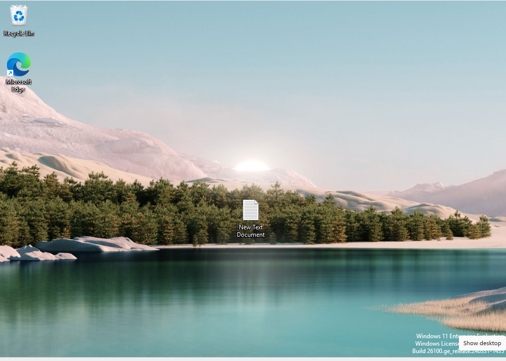
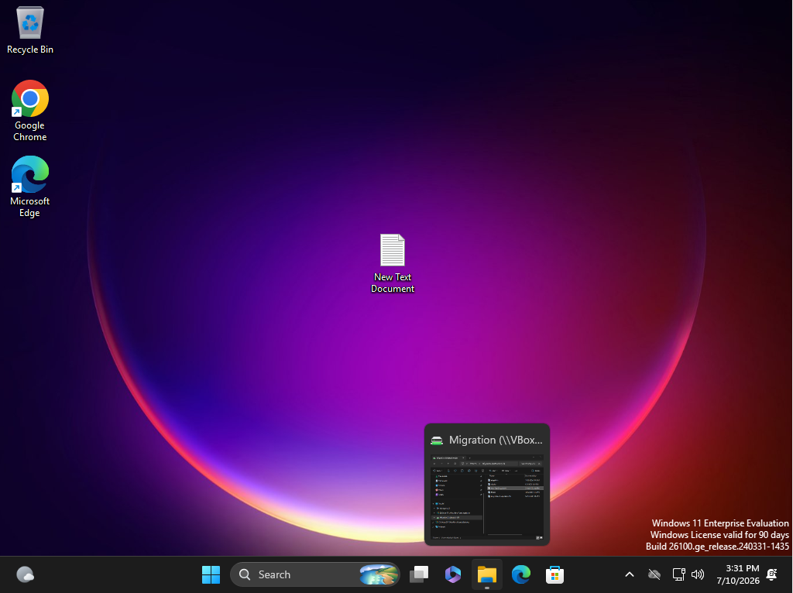

# Windows Endpoint & Identity Support Lab

Hands-on lab simulating a real PC Technician workflow: OS installation,
application configuration, and end-to-end data migration from an old
machine to a new one.

## What this covers
- Fresh Windows 11 installation and post-install configuration
- Application installation and configuration
- User profile data migration between machines using a shared folder
- Documentation of each step with screenshots

## Environment
- VirtualBox, two Windows 11 Enterprise evaluation VMs (OLD-MACHINE, NEW-MACHINE)

## Steps
1. Built and configured OLD-MACHINE with a sample user profile
2. Built and configured NEW-MACHINE, fully patched, with core applications installed
3. Set up a VirtualBox shared folder between host and both VMs
4. Migrated user files from OLD-MACHINE to NEW-MACHINE via the shared folder
5. Verified files transferred correctly

## Screenshots

